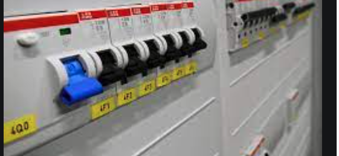

#### A Super Simple Circuit Breaker On the Wall

Following up to the learning on https://martinfowler.com/bliki/CircuitBreaker.html and https://docs.microsoft.com/en-us/azure/architecture/patterns/circuit-breaker.

Quoting Microsoft's doc:

The Circuit Breaker pattern, popularized by Michael Nygard in his book, Release It!, can prevent an application from repeatedly trying to execute an operation that's likely to fail. Allowing it to continue without waiting for the fault to be fixed or wasting CPU cycles while it determines that the fault is long lasting. The Circuit Breaker pattern also enables an application to detect whether the fault has been resolved. If the problem appears to have been fixed, the application can try to invoke the operation.

The purpose of the Circuit Breaker pattern is different than the Retry pattern. The Retry pattern enables an application to retry an operation in the expectation that it'll succeed. The Circuit Breaker pattern prevents an application from performing an operation that is likely to fail. An application can combine these two patterns by using the Retry pattern to invoke an operation through a circuit breaker. However, the retry logic should be sensitive to any exceptions returned by the circuit breaker and abandon retry attempts if the circuit breaker indicates that a fault is not transient.

A circuit breaker acts as a proxy for operations that might fail. The proxy should monitor the number of recent failures that have occurred, and use this information to decide whether to allow the operation to proceed, or simply return an exception immediately.

The proxy can be implemented as a state machine with the following states that mimic the functionality of an electrical circuit breaker:

- Closed: The request from the application is routed to the operation. The proxy maintains a count of the number of recent failures, and if the call to the operation is unsuccessful the proxy increments this count. If the number of recent failures exceeds a specified threshold within a given time period, the proxy is placed into the Open state. At this point the proxy starts a timeout timer, and when this timer expires the proxy is placed into the Half-Open state.

The purpose of the timeout timer is to give the system time to fix the problem that caused the failure before allowing the application to try to perform the operation again.

- Open: The request from the application fails immediately and an exception is returned to the application.

- Half-Open: A limited number of requests from the application are allowed to pass through and invoke the operation. If these requests are successful, it's assumed that the fault that was previously causing the failure has been fixed and the circuit breaker switches to the Closed state (the failure counter is reset). If any request fails, the circuit breaker assumes that the fault is still present so it reverts back to the Open state and restarts the timeout timer to give the system a further period of time to recover from the failure.

The Half-Open state is useful to prevent a recovering service from suddenly being flooded with requests. As a service recovers, it might be able to support a limited volume of requests until the recovery is complete, but while recovery is in progress a flood of work can cause the service to time out or fail again.

###### Circuit Breaker states

In the figure, the failure counter used by the Closed state is time based. It's automatically reset at periodic intervals. This helps to prevent the circuit breaker from entering the Open state if it experiences occasional failures. The failure threshold that trips the circuit breaker into the Open state is only reached when a specified number of failures have occurred during a specified interval. The counter used by the Half-Open state records the number of successful attempts to invoke the operation. The circuit breaker reverts to the Closed state after a specified number of consecutive operation invocations have been successful. If any invocation fails, the circuit breaker enters the Open state immediately and the success counter will be reset the next time it enters the Half-Open state.

How the system recovers is handled externally, possibly by restoring or restarting a failed component or repairing a network connection.

The Circuit Breaker pattern provides stability while the system recovers from a failure and minimizes the impact on performance. It can help to maintain the response time of the system by quickly rejecting a request for an operation that's likely to fail, rather than waiting for the operation to time out, or never return. If the circuit breaker raises an event each time it changes state, this information can be used to monitor the health of the part of the system protected by the circuit breaker, or to alert an administrator when a circuit breaker trips to the Open state.

The pattern is customizable and can be adapted according to the type of the possible failure. For example, you can apply an increasing timeout timer to a circuit breaker. You could place the circuit breaker in the Open state for a few seconds initially, and then if the failure hasn't been resolved increase the timeout to a few minutes, and so on. In some cases, rather than the Open state returning failure and raising an exception, it could be useful to return a default value that is meaningful to the application.
